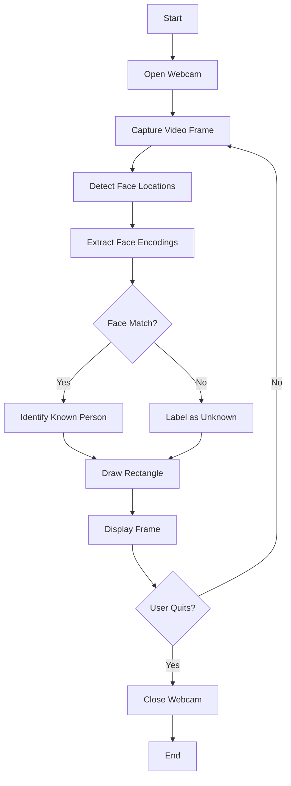

# 💠 Face Recognition with OpenCV and face_recognition


Elevating face recognition technology with **Python**, **OpenCV**, and **face_recognition** to seamlessly integrate **real-time detection** and recognition capabilities with your webcam.

---

## 🌟 Overview

This repository provides an extensible, user-friendly **Face Recognition** solution. Combining **OpenCV** for webcam integration and **face_recognition** for accurate facial recognition, the program detects and identifies faces on-the-fly.

---

## 🚀 Features

- 🎥 **Real-Time Recognition:** Detect and recognize faces in real-time through your webcam.
- 🛠️ **Effortless Setup:** Seamless integration with minimal configuration.
- 🧑‍🤝‍🧑 **Multi-Face Recognition:** Easily customizable to recognize multiple known faces.

---

## 📊 Pipeline Workflow

Our face recognition system follows a streamlined process:



This diagram illustrates the key steps in our face recognition process:
- Open the webcam and begin video capture
- Detect face locations in each frame
- Extract face encodings
- Compare against known faces
- Identify or label faces
- Continuously update and display results

---

## ⚙️ Prerequisites

Ensure these dependencies are installed to get started:

- **Python:** [Download Python](https://www.python.org/downloads/)
- **OpenCV:** Install using:
  ```bash
  pip install opencv-python
  ```
- **face_recognition:** Install using:
  ```bash
  pip install face_recognition
  ```

---

## 🛠️ Installation & Usage

1. **Clone the repository:**
   ```bash
   git clone https://github.com/bniladridas/facerecognition.git
   ```

2. **Navigate to the project directory:**
   ```bash
   cd facerecognition
   ```

3. **Run the script:**
   ```bash
   python src.py
   ```

4. **Start detection:** Point your webcam at the desired area, and watch as faces are detected and recognized in real-time!

---

## 🔧 Configuration

- **Known Faces Customization:** Replace the sample image files with images of faces you want to recognize.
- **Advanced Settings:** Dive into the script for parameter tweaks and additional functionalities.

---

## 🌐 Use Cases

1. **Attendance System:**
   - Automatically mark attendance by recognizing faces of employees or students.

2. **Security System:**
   - Enhance security by allowing access only to recognized individuals.

3. **Photo Organization:**
   - Automatically tag and organize photos based on recognized faces.

4. **Customer Analytics:**
   - Analyze customer demographics and behavior in retail stores.

5. **Personalized User Experience:**
   - Provide personalized content or services based on user recognition.

6. **Law Enforcement:**
   - Assist law enforcement agencies in identifying suspects.

---

## 🤝 Contributing

Contributions make the magic happen! Whether you're fixing bugs, adding features, or suggesting improvements, you're welcome to submit issues or pull requests. 

---

## 📝 License

This project is licensed under the **MIT License**. Check the [LICENSE](https://github.com/bniladridas/facerecognition/blob/main/LICENSE) file for more details.
